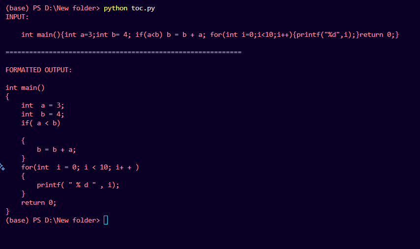

# 📌 TM-Style Code Formatter (C-like Languages)

A Multi-Pass, Turing-Machine-Inspired Code Beautifier

# 🚀 Overview

This project implements a Turing Machine–inspired code formatter for C-like programming languages.
Instead of using traditional parsing libraries or regex rules, this formatter operates on a tape-based model, performing formatting strictly through primitive TM-style operations such as:

- read()

- write()

- move_left()

- move_right()

- insert()

- delete()

The entire formatting process happens through multiple deterministic passes, each responsible for a specific transformation like fixing spacing, inserting braces, normalizing newlines, and computing proper indentation.

This approach demonstrates how real-world text processing can be performed using TOC (Theory of Computation) principles, making it ideal for academic submissions or learning projects.

# 🎯 Key Features
## ✔ Single-Tape Turing Machine Simulation

The formatter treats the input program as a tape of characters and processes it using a single head pointer that moves left or right.

## ✔ Multi-Pass Architecture

- Formatting is broken into clear, sequential passes:

- Normalize whitespace

- Protect for(...) header semicolons

- Add spacing around operators

- Auto-insert braces around single statements

- Insert newlines after semicolons

- Put braces {} on their own lines

- Trim extra blank lines

- Compute indentation based on braces

- Each pass performs only one task, keeping the logic simple and TM-like.

## ✔ Auto-Brace Insertion

If an if, for, or while statement lacks braces, the formatter automatically adds them using structured scanning and parentheses matching.

## ✔ Indentation System

A stack-like indentation counter ensures perfect block alignment according to { and }.

## ✔ TM-Theory Friendly

This project is perfect for TOC students and instructors, demonstrating how practical languages can be processed using computational models.

# 🧠 How It Works

- The formatter takes a string of source code and:

- Converts it into a tape (list of characters).

- Scans the tape left-to-right using TM-like movement.

- Rewrites portions of the tape based on local rules.

- Applies formatting transformations in multiple passes.

- Produces fully formatted, readable C-style code.

This approach shows how complex formatting problems can be solved using simple deterministic automata principles.

# 📸 Screenshots

## Example Screenshot

# 🧩 Why Turing Machine?

- This formatter does not use:

- AST parsing

- Regular expressions

- Python’s built-in string formatting utilities

- Instead, it follows the essence of Turing Machines:

        Tape of symbols

        Head movement

        Read/write primitives

        Deterministic transition logic

This makes it a great showcase of how TOC concepts can be applied to practical software engineering tasks.

# 📘 TOC Concepts Demonstrated

- Turing Machine tape simulation

- Deterministic computation

- Multi-phase TM execution

- String rewriting systems

- Balanced parentheses (context-free languages)

- Decidability of formatting transformations

# 🙌 Acknowledgements

- This project is inspired by:

- Turing Machines

- Multi-pass compiler design

- Code formatting tools like clang-format

- Theory of Computation coursework